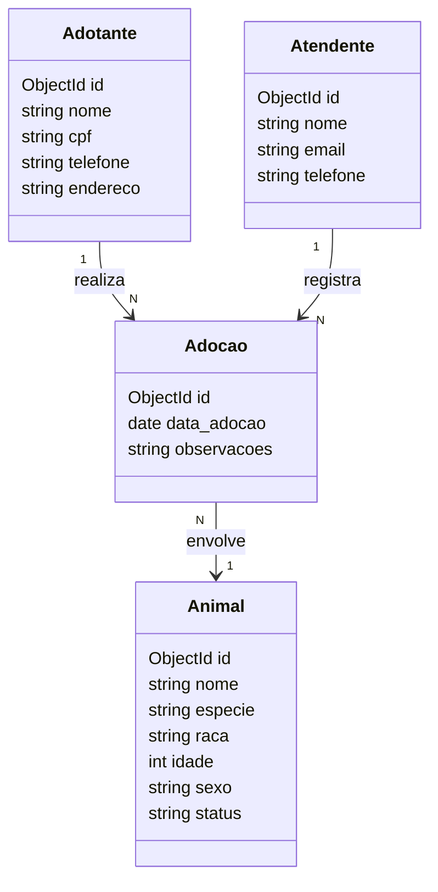
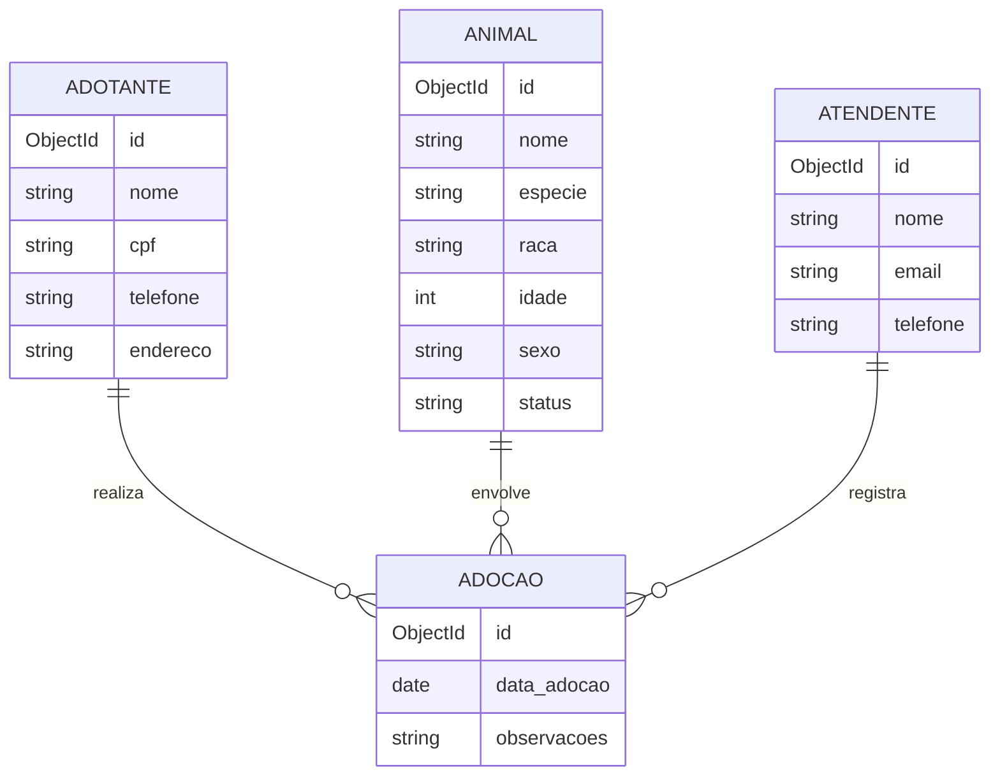

Este projeto implementa uma API REST para gerenciamento de um sistema de adoção de animais, utilizando FastAPI, SQLModel, Alembic e SQLite/PostgreSQL (local e na nuvem usando o supabase).

# Diagrama para representação gráfica das entidades no banco:


# Diagrama 2 (ER):

PS: A tabela AdocaoAtend é uma tabela associativa, necessária para representar o relacionamento muitos-para-muitos entre Adocao e Atendente.

# Estrutura/Pastas do código: 
```txt
trab2_persistencia_2025/
├── README.md                    #descrição do projeto
├── pyproject.toml               #metadados e dependências do projeto (uv)
├── uv.lock                      #lockfile com versões exatas das dependências
├── .python-version              #versão do Python usado no projeto
├── .env                         #variáveis de ambiente (URLs de banco SQLite e PostgreSQL, etc.)
├── main.py                      #cria app FastAPI, inclui as rotas, arq usado pelo unicorn
├── database.py                  
├── modelos/                     #todos modelos aqui
├── rotas/                       #define endpoints HTTP da API (FastAPI routers). Usa os modelos e contem CRUD, consultas complexas e filtros
│   ├── animal.py                
│   ├── adotante.py              
│   ├── atendente.py             
│   └── adocao.py                            
```

## Relacionamentos implementados
1:N
Animal -> Adoção
Adotante -> Adoção
N:N
Adoção <-> Atendente (via tabela associativa)

## Como Executar
```bash
# Ativar ambiente virtual
source .venv/bin/activate

# Instalar dependências
uv sync

# Executar a aplicação
uvicorn main:app --reload
```

### Divisão de trabalho da Equipe
Luana - conexão com mongoDB, endpoints, teste da api
Maria Beatriz - endpoints, povoamento inicial, teste da api
Jade - conexão com mongodb, teste da api